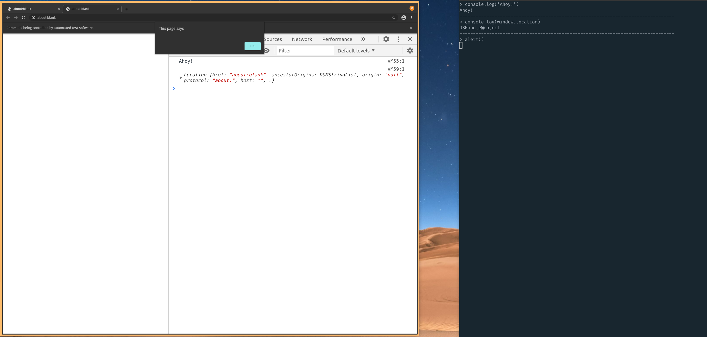

# Puppeteer REPL

A rudimentary [Node Readline][1] REPL into a [Puppeteer][2] Chrome browser
session. Send some JavaScript to execute, get back a reply in the terminal.
Usefulness is as of yet undefined.

```shell
node index.js
# Chrome browser opens
# Input some JavaScript to evaluate in Chrome
# type .exit or <C-c> at the prompt to exit
```



[1]: https://nodejs.org/api/readline.html#readline_readline
[2]: https://github.com/puppeteer/puppeteer/
